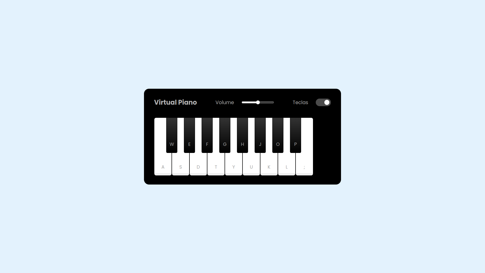

# Virtual-piano

## 📋 Índice

- [📖 Sobre](#-Sobre)
- [🚀 Tecnologias utilizadas](#-Tecnologias-utilizadas)
- [🖥 Preview](#-Preview)
- [📌 Créditos](#-Créditos)

## 📖 Sobre
Projeto desenvolvido durante o Treinamento de Front-end com o professor [Felipe Aguiar](https://github.com/felipeAguiarCode). O objetivo desse projeto desenvolver um simulador de piano totalmente funcional, utilizando apenas HTML, CSS e Javascript e arquivos de audio.

## 🚀 Tecnologias utilizadas

## 🖥 Preview:

  
  

## 📌 Créditos:
  - Os áudios utilizados no projeto foram retirados do repositório: [felipeAguiarCode/js-music-keyboard-virtual](https://github.com/felipeAguiarCode/js-music-keyboard-virtual)